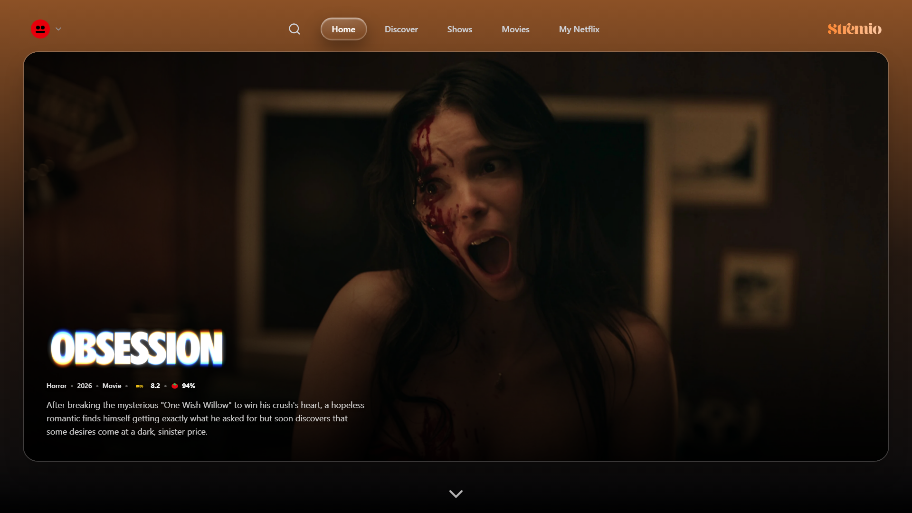
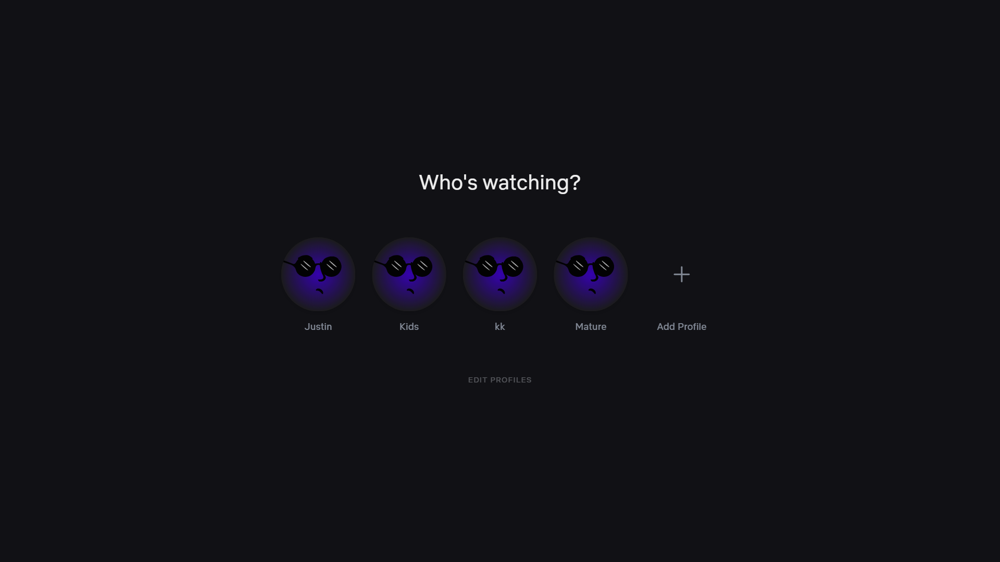
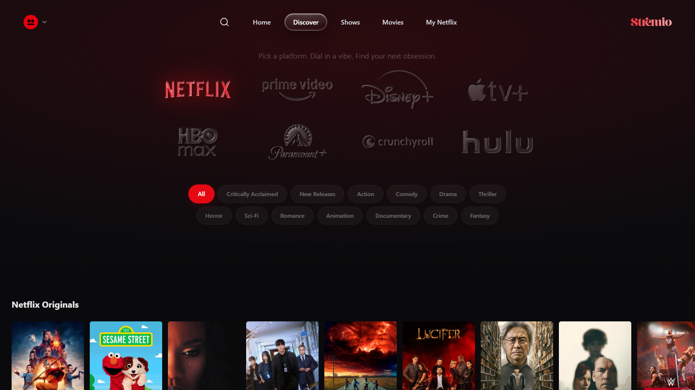

# 🎬 React Media Streaming App


A high-performance, responsive, and beautifully designed Media Streaming Application. This monorepo includes a cutting-edge React frontend powered by Vite and a robust Node.js backend.

## ✨ Features

- **Dynamic Glassmorphism UI**: Stunning interface with smooth animations and hover effects.
- **Profiles Management**: Multi-profile support with personalized watch progress.
- **Cross-Platform Sync**: Native Trakt integration for bidirectional scrobbling.
- **Stream Caching Engine**: Custom in-memory cache on the backend reducing resolve time to <200ms.
- **Smart "Continue Watching"**: Automatically tracks progress and skips intros/credits dynamically.
- **Zero-Staleness Architecture**: Crash-proof local watch progress registry using `localStorage` syncing with the cloud.

---

## 📸 Screenshots

### Home Screen


### Profile Selection


### Discover & Search


---

## 🚀 Getting Started

### 1. Clone the repository
```bash
git clone https://github.com/your-org/media-streaming-app.git
cd media-streaming-app
```

### 2. Environment Setup
Create a `.env` file in the `backend/` directory based on the `.env.example`:
```bash
# Add your configuration, e.g., TMDB API Keys, Real-Debrid tokens, etc.
```

### 3. Install Dependencies
```bash
# Install frontend dependencies
npm install

# Install backend dependencies
cd backend
npm install
```

### 4. Run the Application
Start both the frontend and backend servers.
```bash
# In the root directory (Frontend)
npm run dev

# In the backend directory (Backend)
npm run dev
```

---

## 🏗️ Architecture

### **Frontend**
- **Framework**: React 19 + Vite
- **Styling**: Tailwind CSS + Framer Motion (for animations)
- **State Management**: Zustand
- **Routing**: React Router DOM

### **Backend**
- **Runtime**: Node.js
- **API Resolution**: Torrentio + TMDB integration
- **Caching**: 4-hour TTL in-memory custom stream cache

---

---

## 📜 License
This project is licensed under the MIT License.
